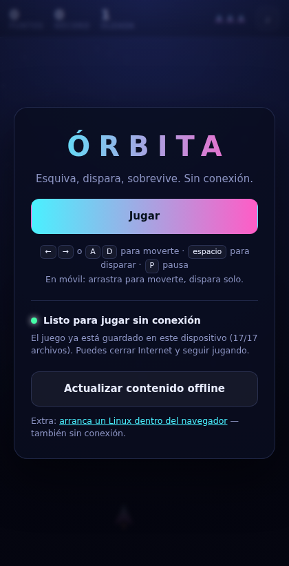
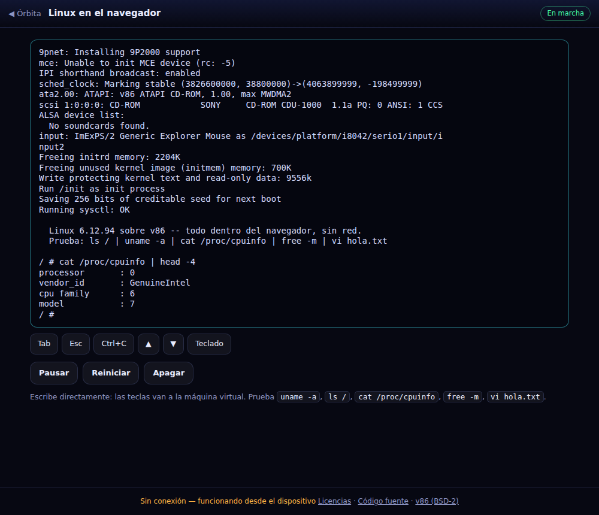

# Órbita — juego arcade (y un Linux) que funcionan sin conexión

Web instalable (PWA): al abrirla ofrece **instalarla** y **descargar todo su contenido**
en el dispositivo, así que después puedes abrirla y jugar sin internet (incluso en modo avión).

Trae dos cosas:

- **Órbita**, un arcade espacial en canvas.
- **`/linux/`**, un **Linux 6.12 de verdad** arrancando en el navegador sobre el emulador
  **v86**, que también se descarga para usarlo sin conexión.





## Cómo probarla

Necesita **HTTPS o localhost** (es un requisito de los service workers; con `file://` no funciona).

```bash
python3 -m http.server 8000
# abre http://localhost:8000
```

## Cómo publicarla en GitHub Pages

Dos opciones:

- **Sencilla**: *Settings → Pages → Source: Deploy from a branch*, elige la rama y la carpeta `/ (root)`.
- **Con Actions**: fusiona a `main` y el workflow `.github/workflows/pages.yml` la despliega
  (*Settings → Pages → Source: GitHub Actions*).

La URL resultante (`https://<usuario>.github.io/<repo>/`) ya sirve por HTTPS, así que la
instalación y el modo offline funcionan directamente.

## Cómo funciona el modo offline

- `sw.js` es un **service worker** que, al instalarse, descarga y guarda en la caché del
  navegador todos los archivos del juego (HTML, CSS, JS, iconos y manifiesto).
- Después responde **primero desde la caché**: si no hay red, la web se abre igual.
  Las navegaciones caen al `index.html` guardado.
- El botón **«Descargar contenido offline»** fuerza esa descarga a mano y la tarjeta del
  menú muestra cuántos archivos hay guardados (`11/11` = listo).
- El botón **«Instalar»** aparece cuando el navegador lo permite (Chrome, Edge, Android…).
  En iPhone/iPad se instala con *Compartir → Añadir a pantalla de inicio*.
- Para publicar cambios, sube el número de `VERSION` en `sw.js`: el nuevo service worker
  vuelve a descargar todo y borra la caché antigua.

## Linux dentro del navegador (`/linux/`)

**v86** emula un PC x86 traduciendo su código máquina a WebAssembly, y sobre él arranca un
kernel **Linux 6.12** con **BusyBox**. Como son archivos estáticos, el service worker los
guarda igual que el resto: se descargan una vez y luego arrancan **sin red**.

- Pack de **10 MB** (emulador 2,1 MB + BIOS + kernel 5,6 MB + sistema de archivos 2,2 MB),
  con barra de progreso, botón para borrarlo y aviso de lo que ya está guardado.
- Arranca a una shell en **1-2 segundos** con red y en unos **8 segundos** sin ella.
- La consola sale por el **puerto serie** y la dibuja `term.js`, un terminal VT100 propio
  (cursor, regiones de scroll y secuencias ANSI), suficiente para `vi`, `top` o `less`.
  Se usa la serie porque la consola VGA de v86 se congela con este kernel.
- Teclado real en escritorio y teclado del sistema en móvil, más botones de Tab, Esc,
  Ctrl+C y flechas. Las teclas se envían de una en una porque el puerto serie emulado
  no tiene cola y si no se pierden caracteres al escribir rápido.

El sistema de archivos original pesaba 33 MB; está recortado a 2,2 MB dejando BusyBox,
la glibc y poco más (fuera git, X11, CUPS, sqlite, Node, Python…). Los binarios son GPL:
`linux/system/THIRD_PARTY_NOTICES.md` y `linux/system/SOURCE_OFFER.md` viajan con ellos y
**hay que mantenerlos** si redistribuyes esto. La imagen viene del paquete npm
[`sharjeenux`](https://www.npmjs.com/package/sharjeenux) (MIT su envoltorio, GPL/LGPL lo
de dentro) y v86 es BSD-2-Clause.

## El juego

Arcade espacial en canvas, sin ningún recurso externo (los sonidos se sintetizan con
WebAudio y los gráficos se dibujan por código), que es justo lo que permite que funcione
offline sin descargas extra.

- **Teclado**: `←` `→` o `A` `D` para moverte, `espacio` para disparar, `P` pausa, `Enter` para empezar.
- **Móvil**: arrastra el dedo para mover la nave; dispara sola.
- Oleadas cada 22 s, asteroides, cazas que te disparan y mejoras: `S` escudo, `R` disparo
  rápido, `+` vida extra. El récord se guarda en el dispositivo.

## Archivos

| Archivo | Para qué sirve |
| --- | --- |
| `index.html` | Estructura, HUD y menú con los botones de instalar/descargar |
| `styles.css` | Estilos |
| `game.js` | El juego (bucle, física, dibujo y sonido) |
| `app.js` | Instalación, estado del cacheo offline y enlace con el juego |
| `sw.js` | Service worker: descarga y sirve el contenido sin conexión |
| `linux/index.html` · `boot.js` | Página del emulador: descarga del pack y arranque |
| `linux/term.js` | Terminal VT100 que dibuja la consola de la máquina virtual |
| `linux/vendor/` | v86 (emulador y BIOS) |
| `linux/system/` | Kernel Linux, sistema de archivos y avisos de licencia |
| `manifest.webmanifest` | Nombre, iconos y colores de la app instalada |
| `icons/` | Iconos de la app (incluye uno *maskable* para Android) |
