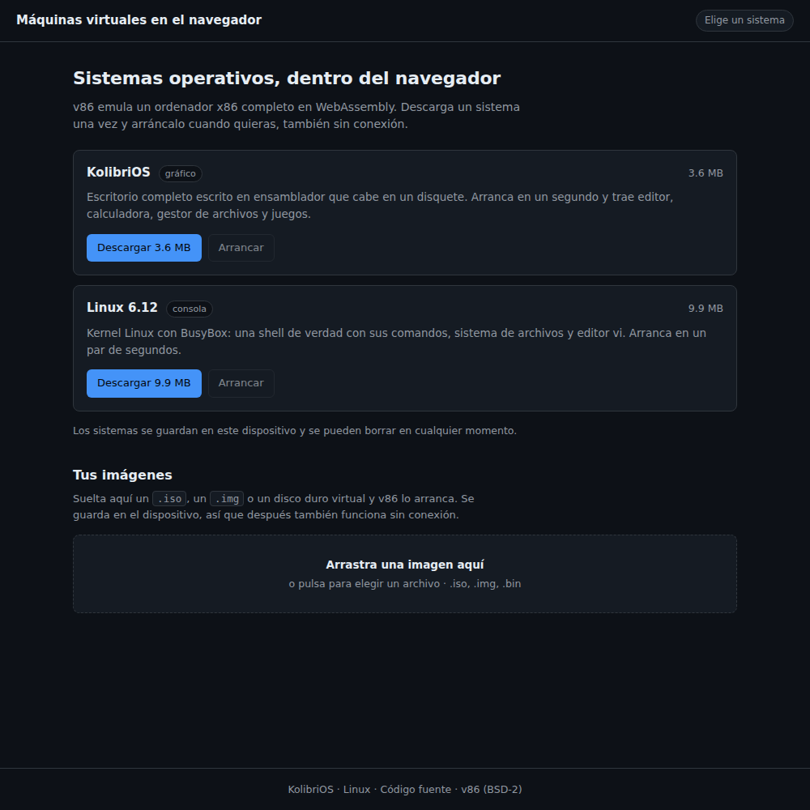
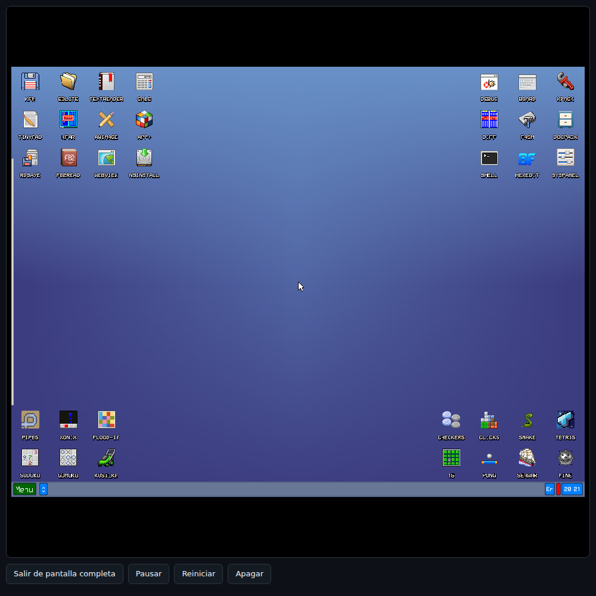

# Sistemas operativos en el navegador, sin conexión

Web instalable (PWA) que arranca **sistemas operativos de verdad** dentro de una pestaña,
sobre el emulador **v86**, y que funciona **sin internet**: descargas el sistema una vez y
a partir de ahí arranca aunque estés en modo avión.





| Sistema | Peso | Qué es |
| --- | --- | --- |
| **KolibriOS** | 3,6 MB | Escritorio gráfico a 1024×768, con ratón, apps y juegos, en un disquete de 1,44 MB |
| **Linux 6.12** | 10 MB | Consola con BusyBox: shell, sistema de archivos y `vi` |
| **La tuya** | — | Suelta un `.iso` o un `.img` y lo arranca |

## Cómo probarla

Necesita **HTTPS o localhost** (es un requisito de los service workers; con `file://` no funciona).

```bash
python3 serve.py
# abre http://localhost:8000
```

Usa `serve.py` y no `python -m http.server`: en Windows, el módulo estándar saca los tipos
MIME del registro, donde `.css` y `.js` suelen estar como `text/plain`. Con ese tipo el
navegador **ignora la hoja de estilos** y **se niega a registrar el service worker**, así que
ni hay diseño ni modo offline. `serve.py` los fija a mano y escucha en las dos formas de
localhost (`127.0.0.1` y `::1`), porque en Windows el navegador prueba antes la IPv6.

## Publicarla en GitHub Pages

*Settings → Pages → Source: Deploy from a branch*, eliges la rama y la carpeta `/ (root)`.
También hay un workflow en `.github/workflows/pages.yml` si prefieres desplegar con Actions.
La URL resultante ya sirve por HTTPS, así que la instalación y el modo offline funcionan.

## Cómo funciona el modo offline

- `sw.js` es un **service worker** que guarda la web en sí (HTML, CSS, JS, iconos) y responde
  **primero desde la caché**, de modo que la página abre sin red.
- Las **imágenes de los sistemas** van en su propia caché (`vm-systems-v1`), descargadas desde
  las fichas con barra de progreso. El emulador y las BIOS (2,3 MB) se comparten entre todos
  los sistemas y solo se borran cuando no queda ninguno.
- Las **imágenes que importas tú** van a **IndexedDB** (`store.js`): son archivos de cientos
  de MB que no vienen de ninguna URL, y se guarda el `Blob` tal cual, sin leerlo entero en
  memoria hasta el arranque.
- Para publicar cambios, sube el número de `VERSION` en `sw.js`: el nuevo service worker
  vuelve a descargar la web y borra la caché antigua, sin tocar los sistemas descargados.

## Detalles de la emulación

**v86** emula un PC x86 traduciendo su código máquina a WebAssembly. Un núcleo, 32 bits, sin
aceleración gráfica: da para sistemas ligeros, no para escritorios modernos.

- KolibriOS llega al escritorio en unos **10 s** y Linux a la shell en **1-2 s**.
- Hay **pantalla completa** para cualquier sistema: se lleva el bloque entero, así que los
  botones de pausar, reiniciar y salir siguen a mano. En el iPhone no aparece, porque Safari
  solo deja poner en pantalla completa los vídeos.
- La interfaz sigue el **modo claro u oscuro** del sistema; la pantalla de la máquina virtual
  va siempre oscura.
- Los sistemas **gráficos** usan el canvas de v86 con teclado y ratón. El ratón es
  **relativo**, así que el cursor de dentro no coincide con el de fuera, como en cualquier
  máquina virtual sin puntero absoluto.
- Los sistemas **de consola** sacan la pantalla por el puerto serie y la dibuja `term.js`, un
  terminal VT100 propio (cursor, regiones de scroll y secuencias ANSI) que aguanta `vi` o
  `top`. Se usa la serie porque la consola VGA de v86 se congela con este kernel.
- Las teclas se mandan **de una en una**: el puerto serie emulado no tiene cola y al escribir
  rápido se perdían caracteres.
- En móvil, un campo invisible saca el teclado del sistema, y hay botones de Tab, Esc,
  Ctrl+C y flechas.

### Guardar y restaurar el estado

Arrancar un escritorio pesado cuesta minutos; restaurarlo, un par de segundos. El botón
**Guardar estado** hace una foto de la RAM y de los dispositivos (`save_state` de v86) y la
mete en IndexedDB; la ficha del sistema pasa entonces a ofrecer **Restaurar estado**, que
arranca la máquina con esa foto como `initial_state`.

Medido aquí: Linux pasa de **7,6 s a 0,5 s** (estado de 42 MB) y KolibriOS de **22 s a 0,2 s**
(15 MB). Los estados también funcionan sin conexión, y se borran con *Olvidar estado*.

### Importar tus propias imágenes

El medio se elige por el archivo: `.iso` → CD-ROM, `.img` de hasta 2,88 MB → disquete, el
resto → disco duro; v86 decide solo el orden de arranque.

La imagen **se puede arrancar en cuanto la sueltas**, sin esperar a que se copie a ningún
sitio: se le pasa a v86 el `File` tal cual y, por encima de 256 MB, v86 lo lee **a trozos**
en lugar de cargarlo entero en memoria. Copiar al dispositivo (que es lo que permite usarla
sin conexión otro día) es un paso aparte: automático por debajo de 64 MB y con el botón
*Guardar en el dispositivo* por encima, porque copiar cientos de MB tarda. Cada imagen tiene su **selector de
RAM** (de 128 MB a 2 GB; v86 es de 32 bits, así que de ahí no se pasa) y recuerda la
elección. Como no se sabe de antemano cómo va a pintar una
imagen ajena, se muestra el canvas y, si además habla por el puerto serie, aparece el terminal
debajo.

Si otra pestaña de la web tiene abierta una versión anterior de la base de datos, la
actualización de IndexedDB se queda bloqueada y las peticiones **no responden ni con éxito ni
con error**. Por eso `store.js` pone un plazo y atiende `onblocked`, y la página pinta las
imágenes recién soltadas antes de consultar la base: aunque no se pueda guardar nada, la
imagen se arranca igual y se avisa de que hay que cerrar las otras pestañas.

Aquí entran Tiny Core (X11), FreeDOS o cualquier distro de 32 bits: te la bajas tú y la
sueltas. Con lo gordo, cuenta con que irá lento.

## Licencias

- **v86**: BSD-2-Clause (`vendor/LICENSE-v86.txt`).
- **KolibriOS**: software libre; procedencia y avisos en `system/KOLIBRIOS.md`. La imagen no
  está modificada.
- **Linux + BusyBox + glibc**: GPL/LGPL. `system/THIRD_PARTY_NOTICES.md` y
  `system/SOURCE_OFFER.md` **tienen que acompañar a los binarios** si redistribuyes esto.
  La imagen viene del paquete npm [`sharjeenux`](https://www.npmjs.com/package/sharjeenux),
  con el sistema de archivos recortado de 33 MB a 2,2 MB (BusyBox y glibc; fuera git, X11,
  CUPS, sqlite, Node y Python).

## Archivos

| Archivo | Para qué sirve |
| --- | --- |
| `index.html` · `styles.css` | La página: catálogo de sistemas y pantalla de la máquina |
| `boot.js` | Descarga de sistemas, importación y arranque de v86 |
| `term.js` | Terminal VT100 que dibuja la consola por el puerto serie |
| `store.js` | IndexedDB: imágenes importadas y estados guardados de las máquinas |
| `sw.js` | Service worker: sirve la web sin conexión |
| `vendor/` | v86 (emulador y BIOS) |
| `system/` | Imágenes de los sistemas y avisos de licencia |
| `serve.py` | Servidor local con los tipos MIME correctos (sobre todo en Windows) |
